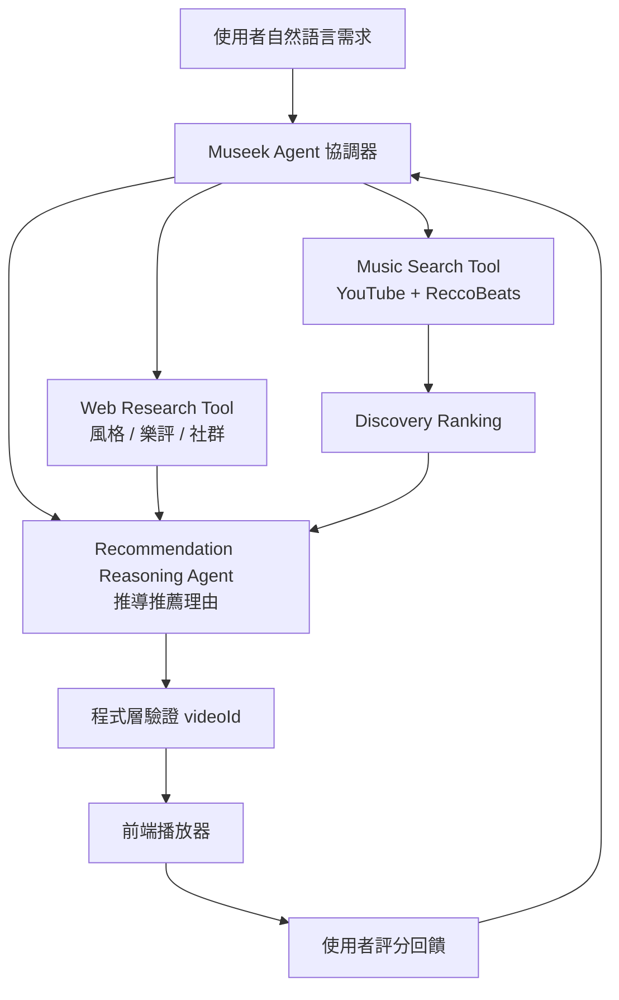
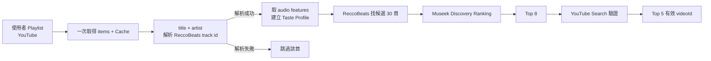
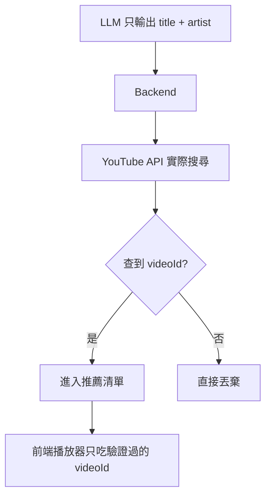

# 🎵 Museek 音樂探索 Agent — 簡報

---

## Slide 1 — 封面

# Museek
### 你的音樂探索夥伴，而不只是推薦引擎

> 用一句話描述心情，Agent 主動探索、分析、並解釋「為什麼你會喜歡」。

---

## Slide 2 — 問題動機

**現有串流推薦的盲點**

- 推薦系統擅長「更多相似的歌」，但**不擅長主動探索**
- 使用者想跳出舒適圈時，仍得自己搜尋、篩選
- 真實需求難以表達：
  > 「我最近很喜歡 XXX，想找**沒聽過，但氛圍相近**的音樂。」

**傳統搜尋 / 推薦系統無法承接這種自然語言需求。**

---

## Slide 3 — 我們的主張

**讓 AI 不只是「推薦歌曲」，而是成為：**

> 能**理解需求 → 主動探索 → 客觀分析 → 解釋理由**的音樂探索夥伴。

核心組合：

`LLM` + `AI Agent` + `Music API` + `Web Search` + `Audio Analysis` + `個人化資料`

---

## Slide 4 — 核心差異化：Discovery Distance（探索距離）

**「冷門」不等於「沒聽過」，而是——**

> 跟你的品味**有關聯，但沒近到只是換一首相似歌**。

$$\text{Discovery Score} = \text{Similarity} \times \text{Familiarity Distance} \times \text{Popularity Factor}$$

| Song | 相似度 | 熟悉度距離 | 熱門度 | Discovery |
|------|--------|-----------|--------|-----------|
| A | 0.95 | 近 | 高 | 低 |
| **B** | **0.82** | **中** | **中** | **★ 高** |
| C | 0.65 | 遠 | 低 | 中 |
| D | 0.30 | 極遠 | 低 | 低 |

**這就是 Museek 的核心價值。**

---

## Slide 5 — 系統架構



---

## Slide 6 — 三個核心元件（職責清楚不重疊）

| 元件 | 定位 | 做什麼 |
|------|------|--------|
| **Music Search Tool** | Music **Retrieval** | 找 track / artist / album、取 playlist、驗證 video |
| **Web Research Tool** | Music **Research** | 查藝人風格、訪談、樂評、社群討論 |
| **Recommendation Reasoning Agent** | 推導理由 | 依**客觀 audio features** 推導「為什麼適合你」 |

> 不是「Search A vs Search B」，而是 **Retrieval vs Research**。

---

## Slide 7 — 資料流 Pipeline



**Audio Features 來源：ReccoBeats**（免費、免 API Key）

> 以 `title + artist` 解析出 **track id** → 取 audio features（**免音檔、免下載**）。
> 曲庫解析不到的歌**直接跳過**，不走音檔上傳。

`tempo · energy · danceability · valence · acousticness · instrumentalness · liveness · loudness · speechiness`

> 不讓 LLM 猜 BPM，一切基於客觀數據。

---

## Slide 8 — Reasoning Agent 如何「不亂掰」

輸入客觀資料：

```json
{
  "user_profile": { "avg_energy": 0.42, "avg_valence": 0.51,
                     "favorite_genres": ["R&B", "Neo Soul"] },
  "candidate":    { "energy": 0.45, "valence": 0.55,
                     "acousticness": 0.72, "tempo": 82 }
}
```

產出有根據的解釋：

> 「這首歌的 Energy、Valence 與你偏好接近，但 Acousticness 更高，符合你想探索**更溫暖、自然音色**的需求。」

---

## Slide 9 — 安全設計：AI 輸出 → 確定性驗證

**問題**：LLM 會幻覺出不存在的歌與假連結。

**做法**：不靠 prompt 限制，靠**程式驗證**。



> **絕不讓 LLM 直接生成 URL。** 幻覺歌曲會在驗證步驟被自動過濾。

---

## Slide 10 — 回饋學習迴圈

**評分不是裝飾，會直接影響下一輪。**

```
Museek 推薦 5 首  →  👍 Song A  👎 Song B  👍 Song C
                          ↓
              更新 User Taste Vector
       (喜歡: energy↑ R&B↑ acousticness↑)
       (不喜歡: high energy↓ electronic↓)
                          ↓
                 重新計算候選分數
```

> MVP 不需複雜 ML，加權特徵即可展示「**Agent 會從回饋持續學習**」。

---

## Slide 11 — MVP 範圍與務實取捨

| 項目 | MVP | 未來 |
|------|-----|------|
| Playlist 來源 | **公開 Playlist URL** | Google OAuth / 私人 Playlist / 聆聽紀錄 |
| YouTube Quota | 搜尋**只在最後驗證步驟**（省 units） | 快取 + 批次最佳化 |
| 回饋學習 | 加權特徵向量 | 線上學習模型 |
| Audio features | ReccoBeats（**track id 免音檔**）；**解析失敗即跳過** | 本地抽取 fallback / 多來源融合 |

> 先證明核心價值，不要第一版就卡在「為什麼 Google OAuth 又壞了？」

---

## Slide 12 — 總結

**Museek = 理解需求 × 主動探索 × 客觀分析 × 可解釋推薦**

- ✅ **Discovery Distance** 重新定義「冷門」——有關聯但有驚喜
- ✅ 客觀 **Audio Features**（ReccoBeats），不靠 LLM 猜測
- ✅ 職責清楚的 **Retrieval / Research / Reasoning** 三元件
- ✅ **確定性驗證**擋住 LLM 幻覺與 prompt injection
- ✅ **回饋迴圈**讓 Agent 越用越懂你

> 不只是推薦歌曲，而是陪你探索音樂的夥伴。
